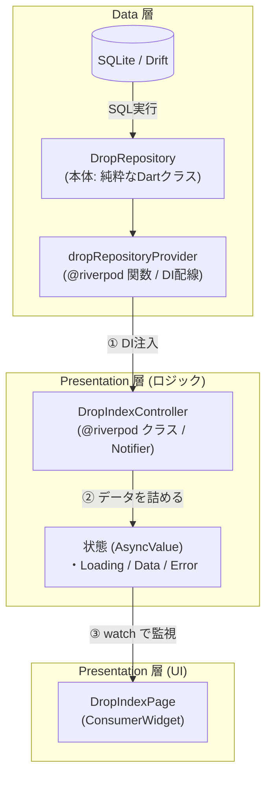
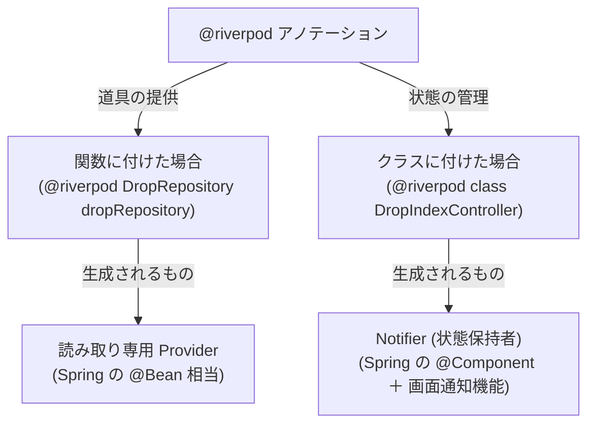

# バックエンドエンジニアのための Flutter / Riverpod アーキテクチャ解説

Java / Spring Boot 開発者のメンタルモデルに合わせて、本プロジェクト（Feature-first MVVM）の設計思想・構文・Riverpod の仕組みを体系的にまとめたドキュメントです。

---

## 1. 全体像とレイヤー対比（パイプライン）

Flutter の Feature-first アーキテクチャは、バックエンドのレイヤードアーキテクチャ（Web API）と非常によく似ています。



### Spring Boot との完全対応表

| レイヤー | 本プロジェクトでの配置 | Spring Boot での相当 | 主な責務 |
| :--- | :--- | :--- | :--- |
| **Domain** | `features/drop/domain/drop.dart` | Entity / 不変 DTO（Java `record` / Lombok `@Value`） | アプリ全体で扱う純粋なビジネスデータモデル |
| **Data (SQL)** | `core/database/tables/drops.drift` | MyBatis / SQL / jOOQ | SQL クエリの定義（自動生成元） |
| **Data (Repo)** | `features/drop/data/drop_repository.dart` | `@Repository` / DAO | DBアクセスと Domain モデルへの詰め替え（マッピング） |
| **Presentation (Logic)** | `features/drop/presentation/*_controller.dart` | Service / ViewModel | 複数 Repo の集約、ビジネスロジック、画面用状態の管理 |
| **Presentation (UI)** | `features/drop/presentation/*_page.dart` | Controller + Thymeleaf / フロントエンド | 画面描画、ユーザー操作の受付 |

---

## 2. Domain 層（freezed）の疑問

### Q. なぜ DB の自動生成クラス（`DropTable` / `GetDropsResult`）をそのまま画面で使わないのか？
- **DB と UI の完全な疎結合**: テーブルのカラム名変更や正規化（JOINの変更）があっても、Repository のマッピングさえ直せば UI 側のコードが壊れないようにするため。
- **UI 向けの便利メソッドを持たせるため**: ドメインモデルには `isTransfer`（振替かどうか）や `formattedAmount` などのゲッター・業務ルールを追加できる。
- **freezed の強力な機能を使うため**: イミュータブル（不変）、値の同値性（`==`）、部分複製（`copyWith`）が使える。

### Q. freezed の構文が Java と全然違うのはなぜ？
- Flutter はスマホ実機で高速に動かすため、AOT（事前コンパイル）を行っており、**リフレクション（実行時の型走査）を完全禁止**している。
- そのため、Lombok のように裏でバイトコードを書き換えるのではなく、`build_runner` を使って**別ファイル（`.freezed.dart`）に具象クラスを自動生成して合体（Mixin / part-of）させる**アプローチをとる。

---

## 3. Data 層（Repository）の Dart 構文の謎解き

### ① `DropRepository(this._db);`
- **正体**: Lombok の **`@RequiredArgsConstructor`** と全く同じ。
- Dart の言語機能（初期化仮引数）で、引数に `this.フィールド名` と書くだけで代入まで完了する。

### ② `_db` と `db` の違い（アンダースコア `_`）
- Dart には `public` や `private` というキーワードが存在しない。
- **先頭に `_` を付けると private（非公開）、付けないと public（公開）** になる。
  - `final AppDatabase _db;`: クラスの外から勝手に DB を触らせないための **private フィールド**。
  - `final db = ...;`: 関数の中だけの使い捨てローカル変数なので、公開/非公開の区別がなく `_` は不要。

### ③ `extension on GetDropsResult`
- **正体**: **「子クラスを作らずに（継承せず）、既存クラスに外付けでメソッドを追加する機能」**（Java には存在しない）。
- `_toDomain()` で `id: id`（または `id: this.id`）と書けるのは、あたかも `GetDropsResult` クラスの中にいる状態になるため。
- **名前なし（無名拡張）** にすることで、その `.dart` ファイル内限定の private な変換関数としてカプセル化できる。

---

## 4. Riverpod の正体（DI ＋ 状態管理）

「Riverpod は状態管理と聞いていたのに、なぜ DI の話が出てくるのか？」という疑問への回答です。

### 結論：Riverpod は「Spring の DI コンテナ ＋ 画面の自動再描画通知」

| 役割 | Spring Boot | Flutter (Riverpod) |
| :--- | :--- | :--- |
| **DI コンテナ本体** | `ApplicationContext` | **`ProviderScope`**（`main.dart` でアプリ全体を囲む） |
| **インスタンスの登録** | `@Repository` / `@Bean` | **`@riverpod`** アノテーション |
| **インスタンスの取り出し** | `@Autowired` | **`ref.watch(xxxProvider)`** |

### なぜ同じ `@riverpod` なのに「関数」と「クラス」で書き方が違うのか？
**「状態（変化するデータ）を持つかどうか」** で、裏で生成される仕組みが自動で切り替わります。



1. **関数形式（Repository など）**:
   - 状態を持たない単なる「道具（ステートレス）」。
   - `build()` や再描画通知が不要なため、1つの関数でインスタンスの作り方（レシピ）だけを登録する。
2. **クラス形式（Controller など）**:
   - 画面用のデータ（`List<Drop>` など）を体内に抱え込み、追加・削除などで中身が変化する（ステートフル）。
   - そのため、Riverpod の基底クラス（`Notifier`）を継承したクラス形式にする。

---

## 5. 複数 Repository の集約（Controller の役割）

Controller は、画面の都合に合わせて**複数の Repository からデータを集約（アグリゲーション）する**ことができます（Spring の Service 層と同じ）。

```dart
@riverpod
class HomeController extends _$HomeController {
  @override
  Future<HomeScreenState> build() async {
    // 複数の Repository を DI で取得
    final dropRepo = ref.watch(dropRepositoryProvider);
    final bucketRepo = ref.watch(bucketRepositoryProvider);

    // 並行して取得し、1つの画面用 State にまとめて返す
    final drops = await dropRepo.getDrops();
    final buckets = await bucketRepo.getBuckets();

    return HomeScreenState(drops: drops, buckets: buckets);
  }
}
```

---

## 6. 実務での心得：どこまで暗記すべきか？

- **覚えるべき本質**:
  - `Domain` / `Data` / `Presentation (Controller + UI)` の4つの役割分担。
  - `ref.watch` で受け取って画面に流すというデータフロー。
- **暗記しなくていいこと（AI / コピペでOK）**:
  - `part 'xxx.g.dart';` などのインポート構文
  - `extension` の詰め替えフィールド列挙
  - `@riverpod` や `freezed` のお決まり構文
